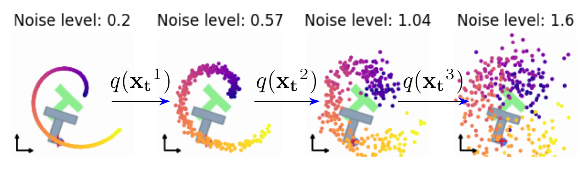
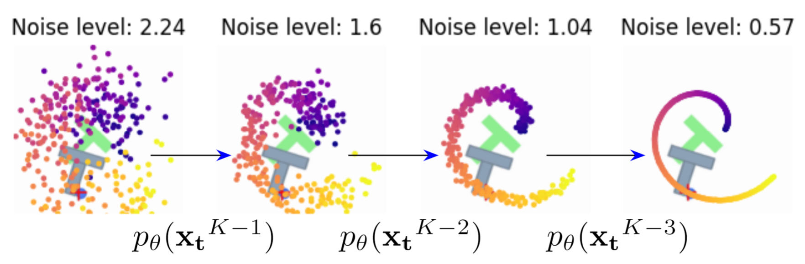

# Mutual Information Diffusion Policy

This repository contains the code for the paper "Mutual Information Neural-Diffusion Policy: trajectory convergence in Robot Manipulation with Mutual Information Estimation Lower Bound" by [Felipe de Jesús Félix Arredondo]

## Abstract

This paper presents a novel regularization method designed to enhance trajectory generation in robotic motion planning and behavior. The proposed approach integrates diffusion policies with conditional diffusion processes and a mutual information neural estimator to improve a robot’s trajectory-following capabilities. The method focuses on generating sequences of actions from an initial set of noise points using the diffusion policy, followed by employing the mutual information neural estimator. This enables the model to learn complex, nonlinear features in high-dimensional spaces during training while refining the gradient field produced by the energy-based model to support continuous action sequences. Experimental results demonstrate that this framework significantly improves the robot’s accuracy, enabling the use of smaller models without compromising performance. These advancements open new opportunities for robotic control and motion planning by leveraging this regularization technique.

### Model Behavior

[](src/images/input.png)

[](src/images/output.png)

### Video


https://github.com/user-attachments/assets/57570e90-52a2-4b78-8198-4de826dfe527


## Installation

To install the required dependencies, run the following command:

```bash
pip install -r requirements.txt
```

## Usage

To train the model, run the following command:

```bash
python train.py
```

This command will train the model for 100 epochs and save the model weights in the `model\saves` directory.

To test the model, run the following command:

```bash
python test.py
```

This will generate a render for the environment and display the results, which are calculated by the average of the maximum reward obtained in 100 episodes.
